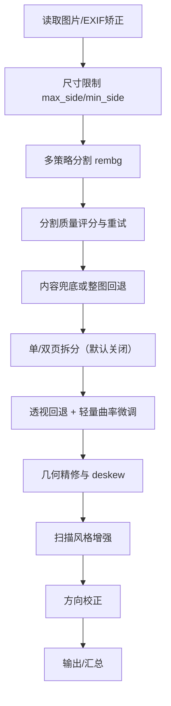

# 舔狗的文档照片自动识别裁剪系统

这个项目是用来处理拍照的文档照片的，可以自动识别裁剪。也可以识别单页和双页。

我之所以会做这么无聊的程序，是因为办公室里有个小姐姐我很喜欢，
有一天领导让她把几百个手机拍的文件照片裁剪出来，并做成合并成PDF。
我看了很心疼，想当舔狗帮她，所以用codex写了这个程序。
然后她完成了工作，挺高兴的，但也没怎么理我。
舔狗果然是没有未来的。


## 作为 MCP Skill 使用（推荐）

最简单的使用方式，无需手动配置 Python 环境。

### ⚠️ 重要：首次使用需下载 400MB 模型

**核心依赖需要下载 AI 模型文件（约 400MB）。强烈建议先执行预热命令，否则第一次使用会卡住 2-5 分钟：**

```bash
uvx --from git+https://github.com/liusanye/auto_scan auto-scan-mcp --warmup
```

等待下载完成后，再添加到 Claude Code。

### 快速安装

1. 安装 [uv](https://github.com/astral-sh/uv)（Python 包管理器）
2. **执行预热命令**（下载 400MB 模型，见上方 ⚠️）
3. 在终端添加到 Claude Code：

```bash
claude mcp add --transport stdio docscan -- uvx --from git+https://github.com/liusanye/auto_scan auto-scan-mcp
```

4. 重启 Claude Code，然后可以直接对话：
   - *"帮我扫描这张文档照片"*
   - *"把 ~/Documents 里的所有文档处理成扫描件"*

详细安装说明见 [INSTALL.md](./INSTALL.md)

---

## 传统使用方式

> 目标：将手机拍摄的文档照片转换为“扫描风格”二值图片（默认），也可输出灰度或双输出，使用预训练模型，在 macOS / Apple Silicon CPU 环境可运行。
> 默认输出模式为 `review`（mask + bbox + bw），可切换为 `result` 或 `debug`。
> 当前主流程不包含 OCR；OCR 模块已存在但未接入 pipeline。

## 文档导航
- `README.md`：项目概览与使用说明（以代码为准）
- `DEVLOG.md`：接手速览、变更记录与风险清单
- `planCodex版.md`：架构与演进路线（设计视角）
- `bbox_review.md`：人工 bbox 评审流水账
- `DEBUG_TUTORIAL.md`：可视化调试与成果使用教程
- `examples/README.md`：样例与回归说明

## 快速开始
### 环境准备
- Python 3.10+（推荐 3.11，作为主开发与运行版本）。
- 建议使用虚拟环境：
  ```bash
  python3.11 -m venv .venv311
  source .venv311/bin/activate
  export PYTHONPATH=.
  ```
- 安装依赖（Apple Silicon 建议 silicon 轮子）：
  ```bash
  pip install -r requirements.txt
  # 如遇 numpy/onnxruntime 版本冲突，可显式：
  pip install 'onnxruntime-silicon>=1.16,<1.19' 'numpy<2.0'
  ```
- 环境变量建议：`OMP_NUM_THREADS=1`，避免 onnxruntime 占满所有核。

### 运行命令
- 单文件/目录：
  ```bash
  PYTHONPATH=. .venv/bin/python cli.py --input <文件或目录> --output outputs --mode quality --debug-level bbox
  # 仅分割/裁剪预览：--dry-run
  # 关闭调试：--debug-level none
  # 预热分割模型：--warmup
  # 输出模式：--output-mode review|result|debug（覆盖配置）
  # 输出色调：--tone bw|gray|both（默认 bw）
  ```
- 批量（默认线程池；进程池如权限受限会自动回退）：
  ```bash
  PYTHONPATH=. .venv/bin/python scripts/run_batch.py --input source_images --output outputs --mode auto --concurrency 2 --debug-level bbox
  ```
- 分割策略抽样与导出（只保留 01/02/03 调试图 + summary.csv）：
  ```bash
  PYTHONPATH=. .venv/bin/python scripts/run_strategy_batch.py --input source_images --output outputs_strategy --num 20 --mode quality --debug-level bbox
  ```
- 烟囱测试（当前不含 OCR）：
  ```bash
  PYTHONPATH=. .venv/bin/python scripts/smoke_test.py --input source_images --output outputs_smoke --mode fast --max-files 2 --debug
  ```
- 分割预设评测（对比不同预处理/模型组合的 mask 评分，仅落盘 mask/JSON/CSV）：
  ```bash
  PYTHONPATH=. .venv/bin/python scripts/eval_mask_presets.py --input source_images --output outputs_mask_eval --max-files 10
  ```

> 提示：`--debug` 会将调试级别提升为 `full`（生成大量中间件图）；常规回归建议使用 `--debug-level bbox`。

## 项目结构（与实际代码一致）
```
cli.py                        # CLI 入口
requirements.txt
DEVLOG.md
planCodex版.md
bbox_review.md
examples/README.md
source_images/

docscan/
  config.py                   # 默认配置与模式映射
  context.py                  # Pipeline/Page 结构体
  debug_utils.py              # 调试绘图与保存
  dewarp.py                   # 透视回退 + 轻量曲率微调
  enhance.py                  # 扫描风格增强
  geom_refine.py              # 几何精修（A4 微调/deskew）
  io_utils.py                 # 图像读写 + EXIF 方向矫正
  mask_utils.py               # 兜底内容 mask、评分与边缘削弱
  ocr_paddle.py               # OCR 封装（未接入主流程）
  orientation.py              # 0/90/180/270 方向检测
  output_utils.py             # 输出落盘（PNG/JPEG/预览）
  page_split.py               # 单/双页判定与裁剪
  pipeline.py                 # 主流程串联
  postproc.py                 # 单页处理封装（dewarp/refine/enhance）
  postprocess.py              # OCR 后处理占位
  runtime_utils.py            # 运行时配置与图像尺度控制
  segment.py                  # rembg 分割 + 连通域处理
  segment_report.py           # 分割报告/调试输出
  segment_strategy.py         # 多策略分割执行器
  split_module.py             # 拆分页模块封装
  summary_utils.py            # run_summary.json 构建与保存

scripts/
  run_batch.py                # 批量/并发入口
  run_strategy_batch.py       # 分割策略回归与导出
  eval_mask_presets.py        # 预处理组合评测（独立工具）
  smoke_test.py               # 烟囱测试（无 OCR）
  review_bbox.py              # bbox 自动评审
```

## 核心处理流程（与代码一致）


### 关键规则与兜底
- **输入保护**：最长边限制（默认 2400），最小边不足时适度放大，避免分割失败。
- **分割策略**：`u2net → u2netp+matting → light+u2netp+matting` 顺序尝试。
- **重试判定**：`score < 6` 且 `(area_ratio < 0.4 或 rect_ratio < 0.7)` 时自动重试，最多 3 次。
- **强制兜底**：最终结果若 `area_ratio < 0.20` 或 `rect_ratio < 0.60` 会触发内容兜底；兜底失败则回退整图。
- **拆分页**：默认关闭（`split.enable_split=false`），避免误裁剪；开启后才进行单双页判定。
- **去透视/曲率**：使用 mask 透视回退；可选轻量曲率微调（默认开启）。
- **几何精修**：四边形拟合 + A4 比例微调 + deskew；覆盖率不足回退矩形或跳过。
- **增强**：division normalization → CLAHE → Sauvola/Wolf → 轻量锐化。
- **方向校正**：基于投影方差的 0/90/180/270 判定，置信度阈值 1.2（默认开启）。

## 模式与自适应
- `fast`：关闭 dewarp，增强强度减弱。
- `quality`：全流程。
- `auto`：按最长边判定：
  - ≤ 1800：`auto-fast`（关闭 dewarp、轻量增强）
  - 1800–2600：`auto-quality`
  - > 2600：`auto-quality-highres`
- 实际生效模式会写入 `run_summary.json` 的 `mode_effective` 字段。

## 输出与调试
- 关键输出：
  - `21_*_scan_bw.png`：扫描二值图（默认）
  - `20_*_scan_gray.png`：扫描灰度图（`--tone gray` 或 `--tone both` 时输出）
- 调试文件：
  - `01_debug_mask.png`：分割 mask
  - `02_debug_bbox.png`：叠加绿框（裁剪 bbox）+ 粉框（refine quad）+ 蓝色凸包
  - `10/11/12/13/14_*`：仅 `debug-level=full` 才输出
  - `attempts/attempts.json`：分割策略尝试明细（仅 `debug-level=full`）
  - `attempts/*_combined.png`：每次尝试的合并 mask
  - `attempts/*_main.png`：每次尝试的主体 mask
- `run_summary.json`：记录模式、耗时、降级、分割尝试细节、输出路径与 debug overlay。
- 可视化调试说明见 `DEBUG_TUTORIAL.md`。

## 输出模式（output.mode）
- `review`：质量审阅模式，输出 `01_debug_mask.png` + `02_debug_bbox.png` + `21_*_scan_bw.png`，`debug-level=bbox`，默认不产出 JPEG/preview。
- `result`：成果模式，仅输出最终图（默认 bw），不输出调试图。
- `debug`：调试模式，输出全量中间件（`debug-level=full`），便于问题排查。

> `--debug`/`--debug-level` 会覆盖 output.mode 的调试级别；`--tone` 可覆盖输出色调。

## 配置摘要（`docscan/config.py`）
> 仅列出当前主流程中**实际生效**的关键项，完整默认值请以代码为准。

- `limits`: `max_side=2400`，`min_side=480`，`rembg_max_side=1600`。
- `segment_strategy`: 三路策略（u2net / u2netp+matting / light+u2netp+matting）。
- `segment_retry`: `enable=true`，`max_trials=3`，`score_min=6.0`，`area_ratio_min=0.4`，`rect_ratio_min=0.7`。
- `split`: `enable_split=false`，`enable_double=true`，`double_ratio_threshold=1.6`，`valley_prominence=0.08`，`symmetry_tolerance=0.25`。
- `dewarp`: `enabled=true`，`enable_curve_adjust=true`，`curve_max_shift_px=6`。
- `geom`: `enable_refine=true`，`a4_ratio=1.414`，`a4_tolerance=0.10`，`deskew_max_angle=5.0`，`border_px=12`。
- `enhance`: `bw_method=sauvola`，`clahe_clip=2.0`，`sauvola_window=31`，`sauvola_k=0.2`，`unsharp_amount=0.6`。
- `output`: `mode=review`，`tone=bw`，`save_jpeg=false`，`jpeg_quality=95`，`preview_max_side=0`。
- `run`: `debug_level=none`（output.mode 会覆盖）；`--debug` 会强制 `full`。

## 工具脚本说明
- `scripts/run_batch.py`：批量处理，支持线程/进程池；进程池权限受限时自动回退线程池。
- `scripts/run_strategy_batch.py`：随机抽样跑策略，自动改名并只保留 01/02/03；**会清理输出目录**，请用专用输出路径。
- `scripts/eval_mask_presets.py`：独立评测 rembg 预处理组合，不影响主流程。
- `scripts/review_bbox.py`：从 `run_summary.json` 评审 bbox；若找不到 overlay 会回退原图尺寸。
- `scripts/smoke_test.py`：烟囱测试（无 OCR），验证裁剪/几何/增强链路。

## 已知限制与实现备注
- OCR 模块（`ocr_paddle.py`/`postprocess.py`）尚未接入主流程。
- `split.enable_split` 默认关闭；如需拆分页必须显式开启。
- 部分配置项目前未接入：`segment` 组细节参数、`run.segment_preview_side`、`dewarp.enable_polyline`。
- `output.orientation` 相关配置未在默认配置中提供，且未接入主流程。
- `scripts/review_bbox.py` 默认查找 `debug_bbox.png`，与当前输出文件名不一致（会回退原图）。

## 下一步方向
- 接入 OCR（在 pipeline 中增加阶段），补充结构化输出与后处理。
- 补齐拆分页与贴边弱梯度场景的专项回归。
- 清理未接入配置并统一方向校正的配置入口。
