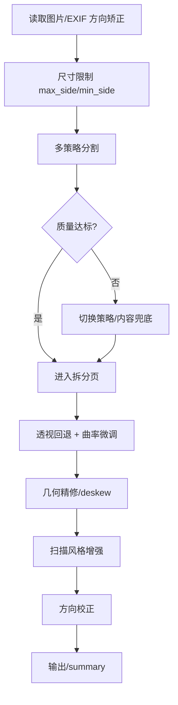

# 文档拍照自动整理系统｜架构与演进说明（基于当前实现）

> 本文档用于描述当前代码的架构与演进路线，内容以 `docscan/*.py` 实现为准。

## 1. 目标与范围
- **输入**：手机拍摄的文档照片（单页/双页、光照不均、角度偏斜等）。
- **输出**：扫描风格灰度图与二值图（PNG/JPEG 可选）。
- **运行环境**：macOS / Apple Silicon CPU，仅使用预训练模型。
- **当前范围**：OCR 模块存在但未接入主流程；主流程聚焦图像增强与扫描风格输出。

## 2. 设计原则
- **鲁棒性优先**：每一阶段都允许降级与兜底，保证“有结果”。
- **性能可控**：输入尺寸统一限制，避免 CPU 负载失控。
- **可配置**：关键阈值集中于 `docscan/config.py`。
- **可回溯**：`run_summary.json` 保存每阶段耗时与降级信息，便于回归。

## 3. 模块与职责（与代码一致）
| 模块 | 文件 | 职责 |
| --- | --- | --- |
| CLI | `cli.py` | 解析参数、遍历输入、调用 pipeline |
| 配置 | `docscan/config.py` | 默认配置、模式映射 |
| Pipeline | `docscan/pipeline.py` | 串联流程、调试输出、summary |
| 分割策略 | `docscan/segment_strategy.py` | 多策略分割执行与评分择优 |
| 分割实现 | `docscan/segment.py` | rembg + 连通域 + 区域合并 |
| 拆分页 | `docscan/page_split.py` | 单/双页判定与裁剪 |
| 拆分页封装 | `docscan/split_module.py` | 拆分页开关与包装 |
| 透视回退 | `docscan/dewarp.py` | 透视回退 + 轻量曲率微调 |
| 几何精修 | `docscan/geom_refine.py` | A4 微调、deskew、透视 |
| 增强 | `docscan/enhance.py` | division + CLAHE + Sauvola/Wolf |
| 方向判定 | `docscan/orientation.py` | 0/90/180/270 方向打分 |
| 输出 | `docscan/output_utils.py` | 保存 PNG/JPEG/预览 | 
| 汇总 | `docscan/summary_utils.py` | run_summary 生成 |
| 调试 | `docscan/debug_utils.py` | overlay 绘制与保存 |

## 4. 核心流程与降级路径

### 关键判定
- **分割重试**：`score < 6` 且 `(area_ratio < 0.4 或 rect_ratio < 0.7)`。
- **最终兜底**：`area_ratio < 0.20` 或 `rect_ratio < 0.60` 触发内容兜底；兜底失败回退整图。
- **拆分页**：默认关闭 `split.enable_split=false`；开启后才评估双页。

## 5. 已实现能力
- 多策略分割与评分择优。
- 单/双页判定与裁剪（默认关闭，需手动开启）。
- 透视回退 + 轻量曲率矫正。
- 几何精修（A4 比例微调、deskew）。
- 扫描风格增强（灰度/二值）。
- 方向校正（基于投影方差）。
- 批处理、策略抽样、烟囱测试与 summary 输出。
- 输出色调可选（bw/gray/both，默认 bw）。
- 输出模式管理（review/result/debug，默认 review）。
- 可视化调试：debug-level=full 输出策略 attempts 的 mask 与 manifest。

## 6. 未接入 / 预留项
- OCR 及字段归一化：`ocr_paddle.py` / `postprocess.py` 未接入 pipeline。
- 预处理评测结果未回流主流程（`eval_mask_presets.py` 仅用于评估）。
- 若干配置项未接入：`segment` 组细节参数、`run.segment_preview_side`、`dewarp.enable_polyline`。
- `output.orientation` 相关配置未在默认配置中提供，且未接入主流程。

## 7. 质量与回归建议
- **烟囱测试**：`scripts/smoke_test.py` 验证裁剪/几何/增强链路。
- **策略抽样**：`scripts/run_strategy_batch.py` 抽样输出 `summary.csv` 与关键 debug 图。
- **人工评审**：`bbox_review.md` 记录 `02_debug_bbox.png` 目视结论。

## 8. 路线图建议
- **短期**：接入 OCR 阶段，完善结构化输出；清理未接入配置并统一入口。
- **中期**：优化贴边弱梯度场景，补充高风险样本回归集。
- **长期**：按场景 profile 扩展字段归一化与输出格式。

## 9. 相关文档
- 入口说明：`README.md`
- 变更记录：`DEVLOG.md`
- 评审记录：`bbox_review.md`
- 调试教程：`DEBUG_TUTORIAL.md`
